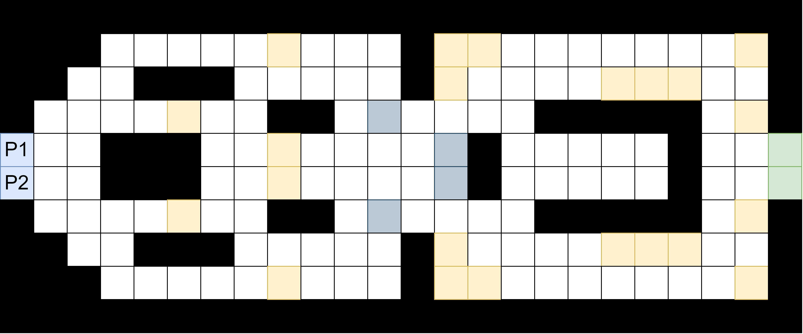
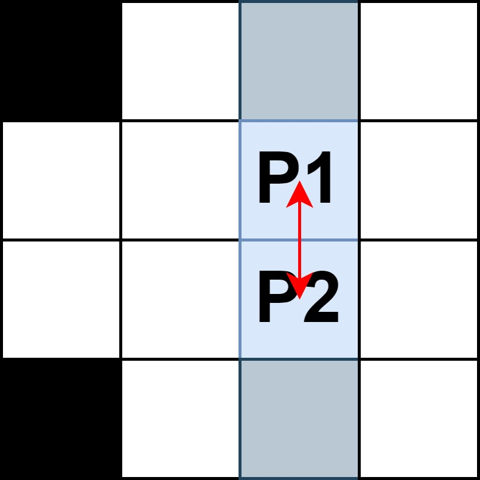

# Preteky

Hra Preteky je prostredie, v ktorom sa pretekajú dve autá, pričom ich cieľom je dostať sa do cieľa čo najrýchlejšie - za čo najmenší počet krokov. Aby úloha pretekajúcich nebola taká jednoduchá, dráha je plná prekážok a nedeterministických pozícií.

Mapu môžete vidieť na obrázku nižšie. Obaja hráči začínajú na ľavej strane dráhy (pozície `P1` a `P2`), a ich cieľom je dostať sa na niektorú z pozícií označených zelenou farbou na opačnom konci pretekárskej dráhy. K dosiahnutiu tohto cieľa majú hráči k dispozícii štyri akcie: pohyb nahor, doprava, doľava a dole. Hru vyhrá pretekár, ktorý sa rýchlejšie dostane do cieľa.

Ako môžete vidieť, pozície sú označené rôznymi farbami a to nasledovne:

* čierna - reprezentuje stenu; ak sa hráč chce dostať na takúto pozíciu, narazí do steny a hra preňho skončí neúspešne;
* žltá - piesok, bezpečnostná zóna, v ktorej sa hráč môže uviaznuť na pozícii: vo vybranom smere urobí krok iba s pravdepodobnosťou 20%, v opačnom prípade ostane na svojej pozícii;
* sivá - na pozícii sa šmýka, čo bolo spôsobené olejom: na takýchto pozíciach prechody sú nepredvídateľné, bez ohľadu na to, ktorú akciu hráč vyberie, posunie sa v náhodnom smere dva pozície (ak medzitým nenarazí do steny).

Okrem nabúrania do steny, hra sa môže končiť predčasne v prípade, ak sa obaja pretekári chcú dostať na rovnakú pozíciu, alebo ak si chcú vymeniť pozície, v takýchto prípadoch dôjde k havárii (viď obrázky nižšie).

## Štruktúra projektu
V kostre riešenia nájdete priečinok s názvom *racing*, ktorý obsahuje nasledovné súbory:

* `racing.py` - implementácia hry Preteky s rozhraním, ktoré poznáte z OpenAI gym. Vaši agenti môžu komunikovať s týmto prostredím cez funkcie `reset` (vráti agentov na štartovacie pozície) a `step` (pre aktualizáciu prostredia na základe akcie agenta; rozdiel je, že táto funkcia očakáva dva parametre: akcia jedného aj druhého hráča).
* `bots.py` - niekoľko botov, ktorých môžete ale nemusíte využiť pri trénovaní, resp. pri vyhodnocovaní vášho riešenia. `RandomBot` vždy vyberie náhodnú akciu. `SmartBot` vyberie takú akciu, ktorou predíde zrážke so stenou. `SmarterBot`  okrem vyhýbaniu sa stien jazdí tak, aby vždy ostal na bielych pozíciách (okrem štartu a ciele).
* `main.py` - obsahuje ukážkové testovanie hry s dvomi agentmi. Nasimuluje sa 1000 pretekov, a určí sa, v koľkých vyhrá hráč 1, hráč 2, a koľkokrát sa dostanú do cieľa naraz (alebo nikto sa do cieľa nedostane).
* `solution_racing.py` - skript pre vaše riešenie, zadefinujte vlastným spôsobom agenta, teda triedu `StudentAgent`.

## Vyhodnotenie agentov
Pre túto hru vaše riešenia sa budú vyhodnocovať tak, že si agenti dvoch študentov zahrajú proti sebe 1000 nasimulovaných hier. Hráč získa jeden bod, ak úspešne dokončí preteky, ďalšie dva body dostane, ak sa dostane do cieľa ako prvý - teda za výhru dostane 3 body, za druhé miesto 1 bod a za nedokončené preteky 0 bodov. V prípade remízy - obaja sa dostanú do cieľa v rovnakom čase - obaja získajú 3 body. Vzhľadom na to, že hracie pole je symetrické, poradie agentov (hráč 1 a hráč 2) sa vyžrebuje na začiatku simulovanej hry.
